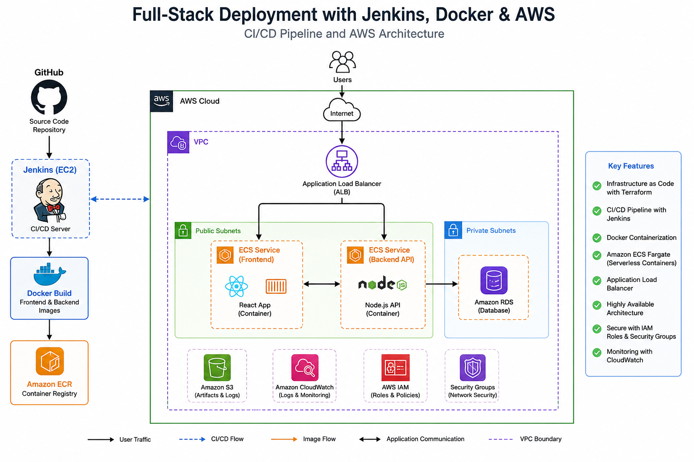
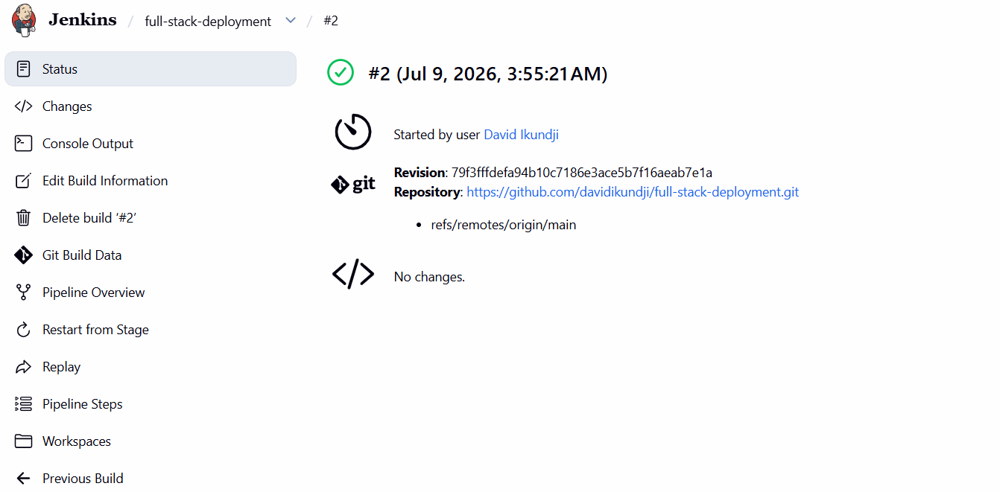
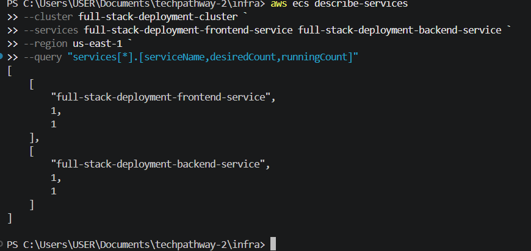
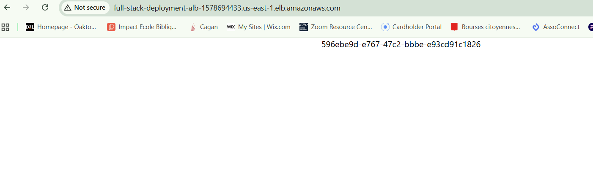

# 🚀 Full-Stack Deployment with Jenkins, Docker & AWS

An end-to-end DevOps project demonstrating Infrastructure as Code (IaC), containerization, CI/CD automation, and cloud-native deployment using AWS.

---

# 📌 Project Overview

This project provisions and deploys a full-stack application on AWS using modern DevOps practices.

The application consists of:

- **React Frontend**
- **Node.js Backend API**
- **Docker Containers**
- **Amazon ECR** for image storage
- **Amazon ECS Fargate** for container orchestration
- **Application Load Balancer (ALB)** for traffic distribution
- **Jenkins** for CI/CD automation
- **Terraform** for Infrastructure as Code (IaC)

The entire deployment is fully automated. Any code pushed to GitHub can be built, containerized, and deployed to AWS through Jenkins.

---

# 🏗️ Architecture



---

# ☁️ AWS Services Used

- Amazon VPC
- Public and Private Subnets
- Internet Gateway
- Security Groups
- Amazon EC2 (Jenkins Server)
- Amazon ECR
- Amazon ECS Fargate
- Application Load Balancer (ALB)
- IAM Roles and Policies
- CloudWatch Logs

---

# 🛠️ Technologies Used

| Technology | Purpose |
|------------|----------|
| Terraform | Infrastructure as Code |
| Jenkins | Continuous Integration & Continuous Deployment |
| Docker | Containerization |
| Amazon ECS Fargate | Container Orchestration |
| Amazon ECR | Container Registry |
| React | Frontend Application |
| Node.js | Backend API |
| Git & GitHub | Source Control |
| AWS CLI | AWS Management |

---

# 📂 Project Structure

```text
Full-Stack-Deployment-with-Jenkins-Docker-AWS/
│
├── backend/
│   ├── Dockerfile
│   ├── package.json
│   └── index.js
│
├── frontend/
│   ├── Dockerfile
│   ├── package.json
│   └── src/
│
├── infra/
│   ├── alb.tf
│   ├── ecr.tf
│   ├── ecs.tf
│   ├── iam.tf
│   ├── jenkins.tf
│   ├── networking.tf
│   ├── outputs.tf
│   ├── provider.tf
│   ├── security.tf
│   ├── terraform.tfvars
│   ├── variables.tf
│   └── user-data/
│       └── jenkins.sh
│
├── screenshots/
├── Jenkinsfile
└── README.md
```

---

# 🚀 Deployment Workflow

## 1. Developer Pushes Code

```bash
git add .
git commit -m "Application update"
git push origin main
```

---

## 2. Jenkins Pipeline Executes

The pipeline automatically:

- Pulls code from GitHub
- Builds Docker images
- Pushes images to Amazon ECR
- Updates ECS services
- Deploys the latest application version

---

## 3. Amazon ECS Fargate Deployment

Amazon ECS:

- Pulls images from ECR
- Creates new tasks
- Registers containers behind the ALB
- Serves the application to end users

---

# 🔄 CI/CD Pipeline

```text
GitHub
   ↓
Jenkins
   ↓
Docker Build
   ↓
Amazon ECR
   ↓
Amazon ECS Fargate
   ↓
Application Load Balancer
   ↓
React Frontend → Node.js Backend API
```

---

# 📸 Project Screenshots

## Jenkins Pipeline Successful Deployment



---

## ECS Services Running



---

## Application Successfully Deployed



---

# 🌐 Live Application

The application is deployed on Amazon ECS Fargate behind an Application Load Balancer.

> **Note:** The ALB DNS name may change if the infrastructure is destroyed and recreated.

Example:

```text
http://full-stack-deployment-alb-xxxxxxxx.us-east-1.elb.amazonaws.com
```

---

# 🔐 Security Implementations

- IAM Roles for Jenkins and ECS Tasks
- Least Privilege Access Model
- Private ECS Subnets
- Security Groups restricting access
- Encrypted EBS volumes
- CloudWatch centralized logging

---

# 📦 Docker Images

The application uses two Docker containers.

### Frontend

```bash
frontend:latest
```

### Backend

```bash
backend:latest
```

Images are stored in:

```text
Amazon Elastic Container Registry (ECR)
```

---

# ⚙️ Terraform Deployment

### Initialize Terraform

```bash
terraform init
```

### Review Changes

```bash
terraform plan
```

### Deploy Infrastructure

```bash
terraform apply
```

---

# 🔄 Jenkins Pipeline Stages

```text
Checkout Source Code
↓
Login to Amazon ECR
↓
Build Frontend Image
↓
Build Backend Image
↓
Push Frontend Image
↓
Push Backend Image
↓
Deploy to ECS
```

---

# 🎯 Project Outcome

This project successfully demonstrates:

✅ Infrastructure as Code using Terraform

✅ Docker containerization

✅ Continuous Integration and Continuous Deployment using Jenkins

✅ Amazon ECS Fargate deployment

✅ Application Load Balancer configuration

✅ Automated image management with Amazon ECR

✅ End-to-end DevOps automation on AWS

---

# 📚 Key Skills Demonstrated

- AWS Cloud Engineering
- DevOps Engineering
- CI/CD Pipeline Design
- Docker Containerization
- Terraform Infrastructure Automation
- Jenkins Administration
- Amazon ECS Fargate
- Application Load Balancing
- IAM Security Best Practices
- Git and GitHub Version Control

---

# 👨‍💻 Author

**David Ikundji**

**AWS Cloud & Devops Engineer**

🐙 GitHub: https://github.com/davidikundji

---

⭐ If you found this project useful, feel free to star the repository!